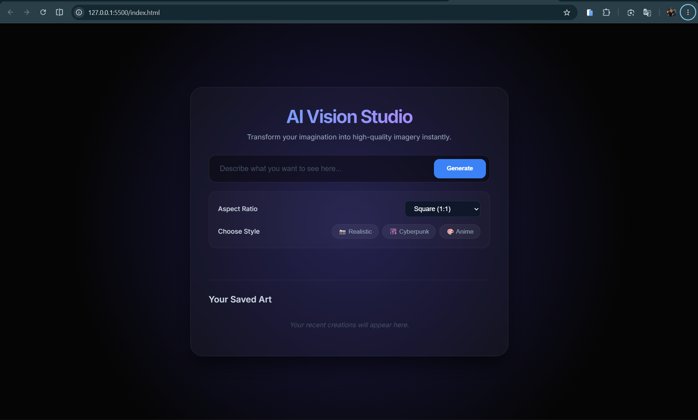

# 🌌 Frictionless (AI Vision Studio)

A minimalist, high-speed text-to-image generator built to eliminate prompt friction and keep your digital art history saved directly in the browser.

---

## 📸 See It In Action


---

## ⚡️ Try It Out Instantly

You can experience the live deployment of the app right here:
👉 **[Try Project Live Demo](https://ai-image-generator-kappa-dusky.vercel.app/)** *(Note: Replace this with your actual Vercel/GitHub Pages live link)*

### Quick Start:
1. Type any creative description in the input bar (e.g., *"A cosmic cat wearing a space helmet"*).
2. Optional: Click on one of the **Enhance Style** buttons (Realistic, Cyberpunk, Anime) to automatically optimize your keywords.
3. Select your desired **Aspect Ratio** (1:1, 16:9, or 9:16).
4. Hit **Generate** and watch your imagination come to life!

---

## 🛠️ How It Works (Technical Architecture)

Unlike heavy full-stack setups, this application is engineered to be lightweight, responsive, and completely client-side. 

### 1. The Generation Pipeline
When you trigger a creation, the script captures your raw text input, marries it with the metadata of your selected style tags, and dynamically computes the absolute resolutions based on your aspect ratio choice ($1280 \times 720$ for 16:9, $720 \times 1280$ for 9:16, etc.). It then streams the structured prompt to the open-source **Pollinations AI API** via client-side fetch.

### 2. Custom Local History Engine
To solve the friction of losing generated art upon browser refreshes, I designed a lightweight state sync using browser **LocalStorage**. Every time an image fully loads (`img.onload`), its direct secure URL and original prompt parameters are prepended into a structured JSON array, capped at a maximum of 6 elements to prevent local storage bloat, and re-rendered into a responsive CSS Grid. Clicking any item in the history sidebar instantly pulls the snapshot back onto the main focus view.

---

## ⚙️ Local Development

Want to run or tweak this project on your machine? It requires no complicated backend environments.

1. Clone the repository:
```bash
git clone [https://github.com/Murodbektuychiyev/Frictionless.git](https://github.com/Murodbektuychiyev/Frictionless.git)
cd Frictionless
